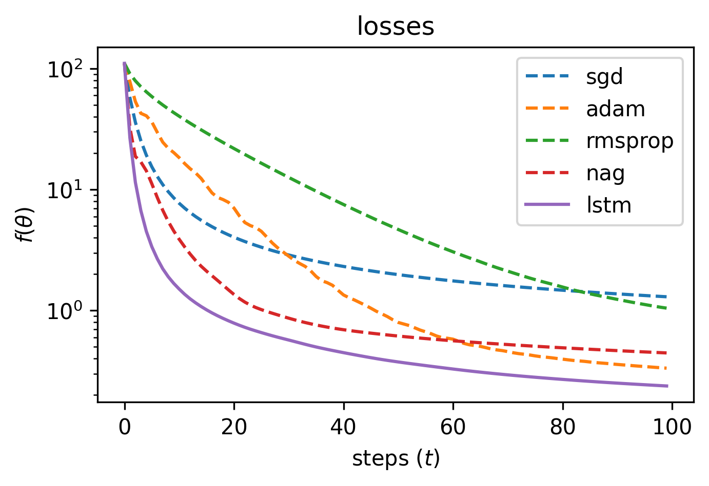

## Learning to learn by gradient descent by gradient descent - Jax

Implementation of [Learning to learn by gradient descent by gradient
descent](https://arxiv.org/abs/1606.04474). It demonstrates how a learned
optimizer, implemented as an LSTM, can outperform commonly used hand-crafted
optimizers.

Currently only the quadratic task is implemented.

## Usage

### Train LSTM Optimizer

Train the LSTM optimizer on random quadratic tasks. [wandb](https://wandb.ai/)
is used for experiment tracking.

```bash
python train.py \
    --unroll_steps 20 \
    --unrolls 5 \
    --learning_rate 1e-2 \
    --steps 1000
```

### Evaluate Optimizers

A search in log-space (e.g. [0.01, 0.03, 0.1, ...]) is performed for each of the
non-learned optimizers to achieve the best final loss on the test task.

```bash
python eval.py --optimizers sgd adam rmsprop nag lstm
```



## Citations

```bibtex
@article{andrychowicz2016learning,
  title={Learning to learn by gradient descent by gradient descent},
  author={Andrychowicz, Marcin and Denil, Misha and Gomez, Sergio and Hoffman, Matthew W and Pfau, David and Schaul, Tom and Shillingford, Brendan and De Freitas, Nando},
  journal={Advances in neural information processing systems},
  volume={29},
  year={2016}
}
```


